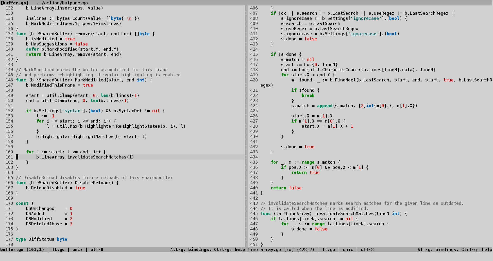

**Donkey** is a finely tuned, 256 color, light-grey background colorscheme for [Micro](https://github.com/zyedidia/micro) text editor.

It is based on my [donbass.vim](https://www.vim.org/scripts/script.php?script_id=2730) colorscheme for Vim.

